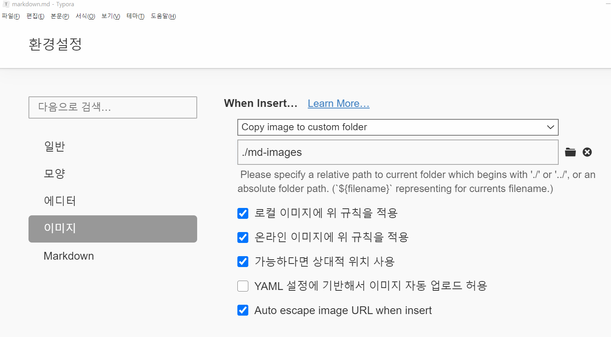

# 마크다운 활용법

## 제목(heading)

제목은 #을 통해 레벨을 지정한다. 

### h3

#### h4

##### h5

###### h6

## 목록

* 순서가 없는 목록
* 순서가 없습니다.
  * 하위는 tab
* shift+tab으로 상위로

1. 순서가 있는 목록
2. 두번째 순서
   1. 하위 목록
3. 목록

## 코드블록

```java
int salary = 5000;
System.out.println("안녕하세요");
// 주석
while (True) {
    // 
    	//	
    		//
}
```

```html
<h1>
   안녕하세요
</h1>
<!-- 주석 -->
```

`//` 은 주석을 작성할 때 사용합니다.

## 링크

[구글](https://google.com)

## 표

| 순번 | 이름   | 비고 |
| ---- | ------ | ---- |
| 1    | 홍길동 |      |
| 2    | 김철수 |      |
| 3    | 이영희 |      |

## 이미지


* 가능하다면 아래와 같이 typora 설정을 하여 상대 경로로 이미지를 관리하자



## 기타

*기울임(이탤릭)*

**볼드체**

~~취소선~~  <- 물결 두개

---


